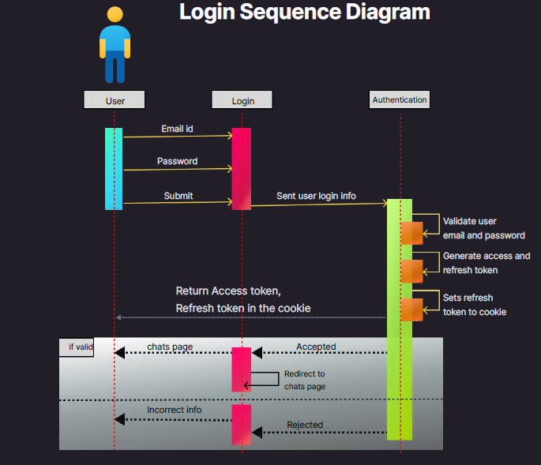
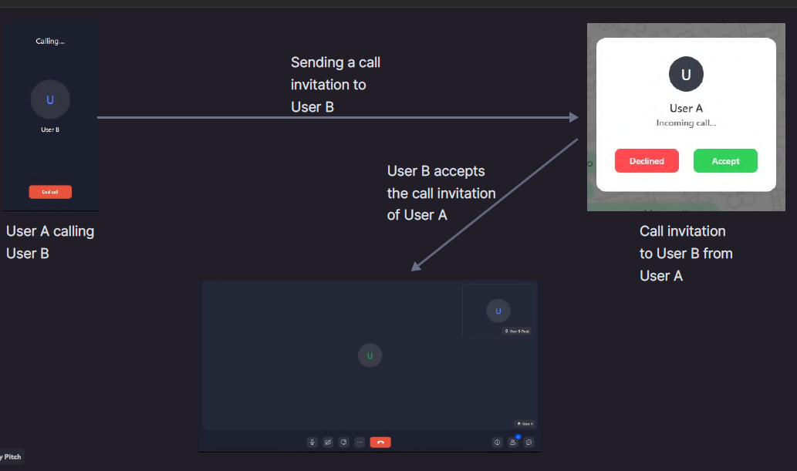
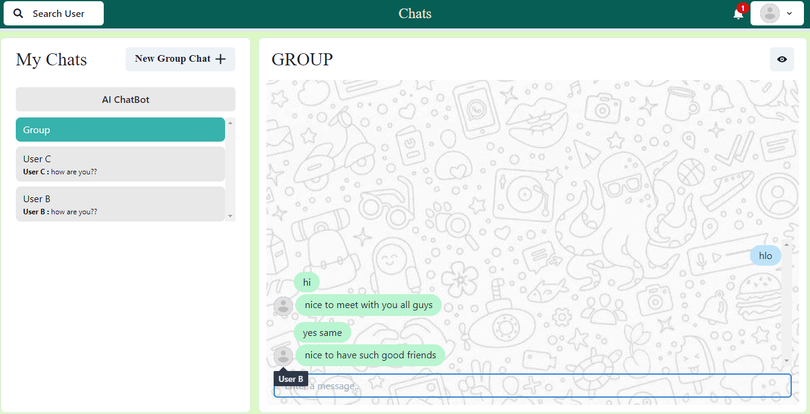

**ChatApp**

Name: - Prince Gupta

University: - IIT Ropar

Department: - Metallurgical and Materials Engineering

**Steps to start the project: -**

1. Go to the project directory
2. `cd chat-app`
3. **Install dependencies**

   a. `npm install`  
   b. `cd frontend/`  
   c. `npm install`  

4. **Start the server**

   a. `npm start`  

5. **Start the Client**

   a. open terminal  
   b. `cd frontend`  
   c. `npm start`  
    

**Login credential: -**

1. **User A: -**

   Click on the button " **Get Guest User Credentials**".

   After that you can login as User A.

2. **User B: -**

   Email: - [example@gmail.com](mailto:example@gmail.com)

   Password: - 123

3. To join a group chat, you need to sign up with a different user, as the minimum group size is 3, and currently, our database only contains two users: 'User A' and 'User B'.

**Introduction: -**

1. The Chat Messaging Web Application is designed to provide users with real-time one-to-one and group chat functionality.

2. The application is equipped with user authentication and authorization using JSON Web Tokens (JWT) for secure access.

3. In addition, it features notification functionality to keep users updated, and audio and video communication capabilities via Zegocloud.

4. To enhance user experience, an AI chatbot is integrated using the Botpress library.

**System Design: -**

